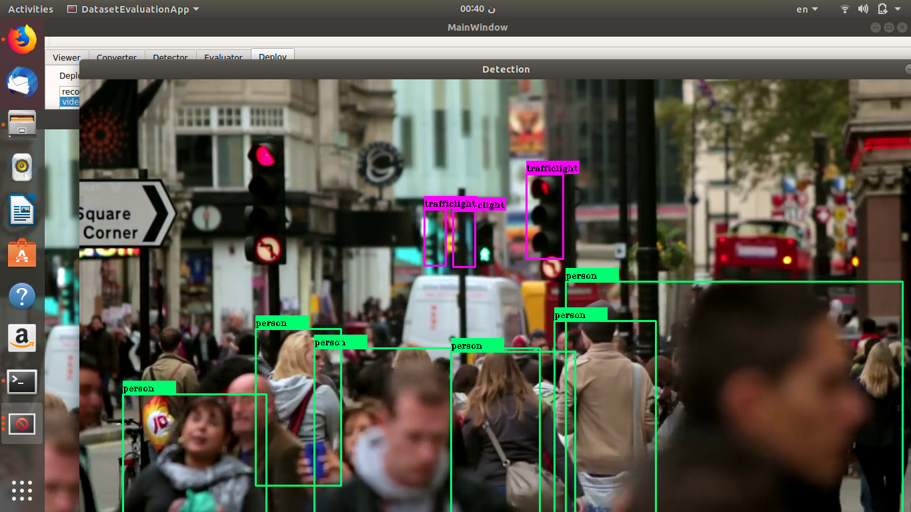

# DeepLearningSuite

[](https://travis-ci.org/JdeRobot/DetectionSuite)

DeepLearning Suite is a set of tool that simplify the evaluation of most common object detection datasets with several object detection neural networks.

The idea is to offer a generic infrastructure to evaluates object detection algorithms againts a dataset and compute most common statistics:
* Intersecion Over Union
* Precision
* Recall

#### Supported Operating Systems:
* Linux
* MacOS


##### Supported datasets formats:
* YOLO
* COCO
* ImageNet
* Pascal VOC
* Jderobot recorder logs
* Princeton RGB dataset [1]
* Spinello dataset [2]

##### Supported object detection frameworks/algorithms
* YOLO (darknet)
* TensorFlow
* Keras
* Caffe
* Background substraction

##### Supported Inputs for Deploying Networks
* WebCamera/ USB Camera
* Videos
* Streams from ROS
* Streams from ICE
* JdeRobot Recorder Logs


## Sample generation Tool
Sample Generation Tool has been developed in order to simply the process of generation samples for datasets focused on object detection. The tools provides some features to reduce the time on labelling objects as rectangles.


# Installation
#### We have AppImages !!!  
###  [Download from here](https://github.com/vinay0410/dl-DetectionSuite/releases/tag/continuous)  


To run,  
First give executable permissions by running  
`chmod a+x DetectionSuitexxxxx.AppImage`  
And Run it by  
`./DetectionSuitexxxxx -c configFile`  


Though you would need `python` in your system installed with `numpy`.  
Also, for using TensorFlow, you would need to tensorflow, and similaraly for keras you would need to install Keras.

If required they can be installed by
```
pip install tensorflow
```
or

```
pip install tensorflow-gpu
```
Similrarly for keras:
```
pip install keras
```

#### Using Docker  
First you need to have docker installed in your computer. If no, assuming you are in Ubuntu, install using the following command

```
 sudo apt install docker.io
```

Now you need to start the docker deamon using
```
sudo service docker start
```

After starting the deamon , get the dl-detectionsuite docker file using
```
sudo docker pull jderobot/dl-detectionsuite
```

Now run the docker image using
```
sudo docker run -it -e DISPLAY=$DISPLAY -v /tmp/.X11-unix:/tmp/.X11-unix jderobot/dl-detectionsuite
```
where the ```-it``` flag instructs Docker to allocate a pseudo-TTY connected to the container’s stdin; creating an interactive ```bash``` shell in the container ,```-e``` tag is used to set the environment variable, in this case ```DISPLAY```, this is required because you will be using GUI for interaction through out rest of the tutorials.
Voila!! You can now use dl-detectionsuite. Proceed to [beginner's tutorial](https://github.com/JdeRobot/dl-DetectionSuite/wiki/Beginner's-Tutorial-to-DetectionSuite-Part-1) to get started.

# Compile and Install from source
To use the latest version of dl-DetectionSuite you need to compile and install it from source.
To get started you can either read along or follow [these video tutorials](https://www.youtube.com/watch?v=HYuFFTnEn5s&list=PLgB5c9xg9C91DJ30WFlHfHAhMECeho-gU).
## Requirements

### Common deps


<table>
<tr>
<td>
<center><b>Ubuntu</b></center>
</td>
<td>
<center><b>MacOS</b></center>
</td>
</tr>
<tr>
<td>
<pre>
sudo apt install build-essential git cmake rapidjson-dev libssl-dev
sudo apt install libboost-dev libboost-filesystem-dev libboost-system-dev libboost-program-options-dev
</pre>
</td>
<td>
<pre>
sudo easy_install numpy
brew install cmake boost rapidjson
</pre>
</td>
</tr>
<tr>
<td>
<pre>
sudo apt install libgoogle-glog-dev libyaml-cpp-dev qt5-default libqt5svg5-dev
</pre>
</td>
<td>
<pre>
brew install glog yaml-cpp qt
</pre>
<br/>
Also, just add qt in your PATH by running:<br/>
<pre>
echo 'export PATH="/usr/local/opt/qt/bin:$PATH"' >> ~/.bash_profile
</pre>
</td>
</tr>
<tr>
<td>
Install OpenCV 3.4
<pre>
git clone https://github.com/opencv/opencv.git
cd opencv
git checkout 3.4
mkdir build && cd build
cmake -D WITH_QT=ON -D WITH_GTK=OFF ..
make -j4
sudo make install
</pre>
</td>
<td>
<pre>
brew install opencv
</pre>

</td>
</tr>
</table>

<!--
### Opencv
```
sudo apt-get install libopencv-dev

```

### Dependencies (Currently being refined and reduced)

```
    sudo apt-get install -y libboost-filesystem-dev libboost-system-dev libboost-thread-dev libeigen3-dev libgoogle-glog-dev \
          libgsl-dev libgtkgl2.0-dev libgtkmm-2.4-dev libglademm-2.4-dev libgnomecanvas2-dev libgoocanvasmm-2.0-dev libgnomecanvasmm-2.6-dev \
          libgtkglextmm-x11-1.2-dev libyaml-cpp-dev icestorm zeroc-ice libxml++2.6-dev qt5-default libqt5svg5-dev libtinyxml-dev \
          catkin libssl-dev
```
-->
## Optional Dependencies

### CUDA (For GPU support)

```
   NVIDIA_GPGKEY_SUM=d1be581509378368edeec8c1eb2958702feedf3bc3d17011adbf24efacce4ab5 && \

     NVIDIA_GPGKEY_FPR=ae09fe4bbd223a84b2ccfce3f60f4b3d7fa2af80 && \
    sudo apt-key adv --fetch-keys http://developer.download.nvidia.com/compute/cuda/repos/ubuntu1604/x86_64/7fa2af80.pub && \
    sudo apt-key adv --export --no-emit-version -a $NVIDIA_GPGKEY_FPR | tail -n +5 > cudasign.pub && \
     echo "$NVIDIA_GPGKEY_SUM  cudasign.pub" | sha256sum -c --strict - && rm cudasign.pub && \

     sudo sh -c 'echo "deb http://developer.download.nvidia.com/compute/cuda/repos/ubuntu1604/x86_64 /" > /etc/apt/sources.list.d/cuda.list' && \
     sudo sh -c 'echo "deb http://developer.download.nvidia.com/compute/machine-learning/repos/ubuntu1604/x86_64 /" > /etc/apt/sources.list.d/nvidia-ml.list'
```

Update and Install

```
sudo apt-get update
sudo apt-get install -y cuda
```

Below is a list of Optional Dependencies you may require depending on your Usage.

* ### Camera Streaming Support
Detectionsuite can currently read ROS and ICE Camera Streams. So, to enable Streaming support install any one of them.

* ### Inferencing FrameWorks
DetectionSuite currently supports many Inferencing FrameWorks namely Darknet, TensorFlow, Keras and Caffe.
Each one of them has some Dependencies, and are mentioned below.

   Choose your Favourite one and go ahead.

   * #### Darknet (jderobot fork)
      Darknet supports both GPU and CPU builds, and GPU build is enabled by default.
      If your Computer doesn't have a NVIDIA Graphics card, then it is necessary to turn of GPU build in cmake by passing ```-DUSE_GPU=OFF``` as an option in cmake.

   ```
       git clone https://github.com/JdeRobot/darknet
       cd darknet
       mkdir build && cd build

   ```

   For **GPU** users:<br>
   ```
   cmake -DCMAKE_INSTALL_PREFIX=<DARKNET_DIR> ..
   ```
   For **Non-GPU** users (CPU build):

   ```
   cmake -DCMAKE_INSTALL_PREFIX=<DARKNET_DIR> -DUSE_GPU=OFF ..
   ```
   Change ```<DARKNET_DIR>``` to your custom installation path.

   ``` make -j4 ``` <br>
   ``` sudo make -j4 install ```

   * #### TensorFlow
   Only depedency for using TensorFlow as an Inferencing framework is TensorFlow.
   So, just install TensorFlow. Though it should be 1.4.1 or greater.

   * #### Keras
   Similarly, only dependency for using Keras as an Inferencing is Keras only.

   * #### Caffe
   For using Caffe as an inferencing framework, it is necessary to install OpenCV 3.4 or greater.


**Note:** Be Sure to checkout the Wiki Pages for tutorials on how to use the above mentioned functionalities and frameworks.  

# How to compile DL_DetectionSuite:

Once you have all the required Dependencies installed just:

```
    git clone https://github.com/JdeRobot/dl-DetectionSuite
    cd dl-DetectionSuite/DeepLearningSuite
    mkdir build && cd build
```
```
    cmake ..
```
To enable Darknet support with GPU:
```
    cmake -DARKNET_PATH=<DARKNET_INSTALLETION_DIR> -DUSE_GPU_DARKNET=ON ..
```
**Note:** GPU support is enabled by default for other Frameworks
```
    make -j4

```

**NOTE:** To enable Darknet support just pass an optinal parameter in cmake `-D DARKNET_PATH ` equal to Darknet installation directory, and is same as `<DARKNET_DIR>` passed above in darknet installation.

Once it is build you will find various executables in different folders ready to be executed :smile:.

## Starting with DetectionSuite
The best way to start is with our [beginner's tutorial](https://github.com/JdeRobot/dl-DetectionSuite/wiki/Beginner's-Tutorial-to-DetectionSuite-Part-1) for DetectionSuite.
If you have any issue feel free to drop a mail <vinay04sharma@icloud.com> or create an issue for the same.

## Sample of input and output




