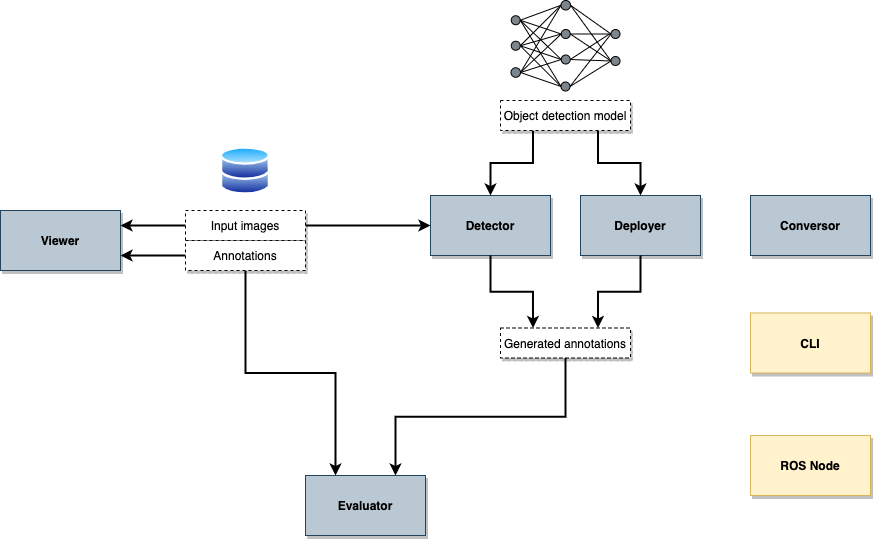
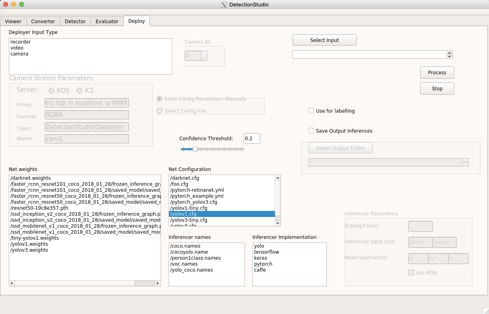
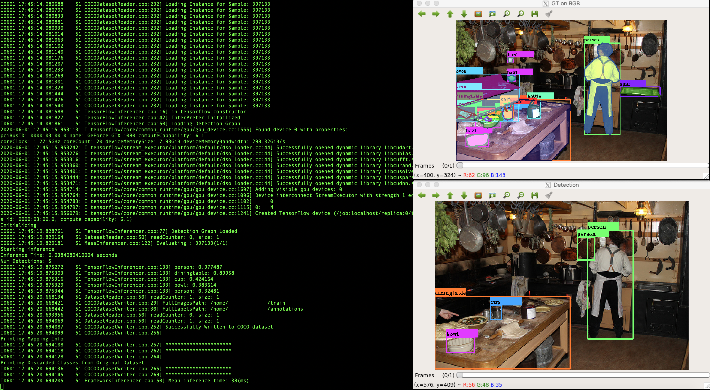

<a href="https://mmg-ai.com/en/"></a>
# Detection Studio

[](https://travis-ci.org/JdeRobot/DetectionSuite)

#### More info and documentation [here](https://jderobot.github.io/DetectionStudio/).

Detection Studio is a set of tools to evaluate object detection neural networks models over the common object detection datasets.
The tools can be accessed using the GUI or the command line applications. In the picture below, the general architecture is displayed.



The tools provided are:
* [Viewer](https://jderobot.github.io/DetectionStudio/functionality/viewer/): view the dataset images with the annotations.
* [Detector](https://jderobot.github.io/DetectionStudio/functionality/detector/): run a model over a dataset and get generate a new annotated dataset.
* [Evaluator](https://jderobot.github.io/DetectionStudio/functionality/evaluator/): evaluate the ground truth dataset with another one and get the comparison metrics.
* [Deployer](https://jderobot.github.io/DetectionStudio/functionality/deployer/): run a model over different inputs like a video or webcam and generate a new annotated dataset.
* [Converter](https://jderobot.github.io/DetectionStudio/functionality/converter/): convert a dataset into another dataset format.
* [Command line application (CLI)](https://jderobot.github.io/DetectionStudio/functionality/command_line_application/): access Detection Studio toolset through command line
* [Detection Studio as ROS Node](https://jderobot.github.io/DetectionStudio/functionality/ros_node/): use Detection Studio as a ROS Node.
+ [Labelling](https://jderobot.github.io/DetectionStudio/resources/gsoc_19/): add or modify labels in the datasets in runtime when running Deployer.

The idea is to offer a generic infrastructure to evaluate object detection models against a dataset and compute the common statistics:
* mAP
* mAR
* Mean inference time.

# What's supported in Detection Studio.

| Support | Detail                                                  |
| ------ | ------------------------------------------------------------ |
| Supported OS  | Linux, MacOS                 |
| Supported datasets  | COCO, ImageNet, Pascal VOC, Jderobot recorder logs, Princeton RGB dataset, Spinello dataset |                |
| Supported frameworks   | TensorFlow, Keras, PyTorch, Yolo-OpenCV, Caffe, Background substraction  |
| Supported inputs in Deployer   | WebCamera/USB Camera, Videos, Streams from ROS, Streams from ICE, JdeRobot Recorder Logs |


# Installation

### Install packaged image

To quickly get started with Detection Studio, we provide a docker image.

* Download docker image and run it
```
    docker run -dit --name detection-studio -v [local_directory]:/root/volume/ -e DISPLAY=host.docker.internal:0 jderobot/detection-studio:latest
```

This will start the GUI, provide a configuration file (appConfig.yml can be used) and you are ready to go. Check out the [web](https://jderobot.github.io/DetectionStudio) for more information

### Installation from source

Check the installation guide [here](https://jderobot.github.io/DetectionStudio/installation/).

# Starting with Detection Studio
Check out the [beginner's tutorial](https://jderobot.github.io/DetectionStudio/resources/tutorial/).


# General Detection Studio GUI

The top toolbar shows the different tools available.

<p align="center">
  
</p>


# Example of detection and console output in Detection Studio

Two image views are displayed, one with the ground truth and the other with the detected annotations.
In the console output, log info is shown.




