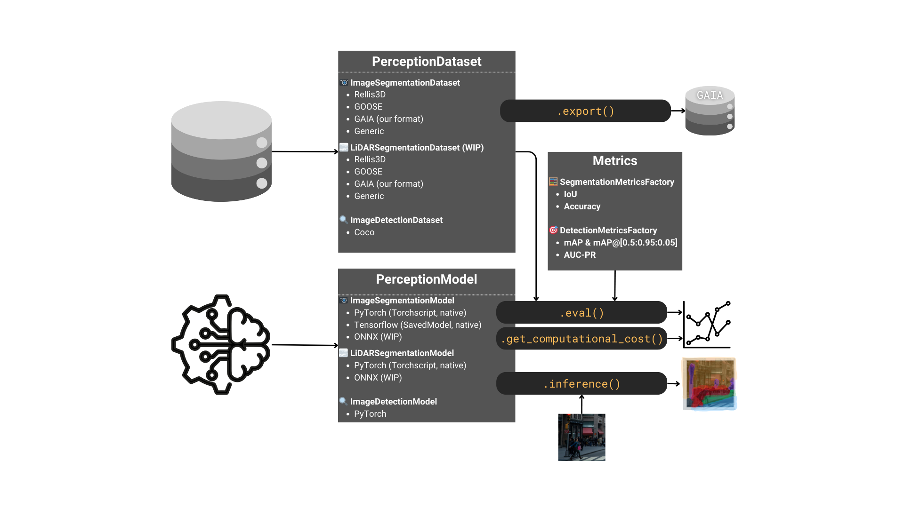

<a href="https://mmg-ai.com/en/"></a>

# DetectionMetrics
### _Unified evaluation for perception models_

#### Project webpage [here](https://jderobot.github.io/DetectionMetrics)

>&#9888;&#65039; ***DetectionMetrics v1*** website referenced in our *Sensors* paper is still available [here](https://jderobot.github.io/DetectionMetrics/v1)

*DetectionMetrics* is a toolkit designed to unify and streamline the evaluation of perception models across different frameworks and datasets. Looking for our published ***DetectionMetrics v1***? Check out all the [relevant links](#v1) below.

Now, we're excited to introduce ***DetectionMetrics v2***! While retaining the flexibility of our previous release, *DetectionMetrics* has been redesigned with an expanded focus on image and LiDAR segmentation, and now includes **image object detection** capabilities. As we move forward, *v2* will be the actively maintained version, featuring continued updates and enhancements to keep pace with evolving AI and computer vision technologies.

<table style='font-size:100%; margin: auto;'>
  <tr>
    <th>&#128187; <a href="https://github.com/JdeRobot/DetectionMetrics">Code</a></th>
    <th>&#128295; <a href="https://jderobot.github.io/DetectionMetrics/v2/installation">Installation</a></th>
    <th>&#129513; <a href="https://jderobot.github.io/DetectionMetrics/v2/compatibility">Compatibility</a></th>
    <th>&#128214; <a href="https://jderobot.github.io/DetectionMetrics/py_docs/_build/html/index.html">Docs</a></th>
    <th>&#128187; <a href="https://jderobot.github.io/DetectionMetrics/v2/gui">GUI</a></th>
  </tr>
</table>



# What's supported in DetectionMetrics

<table><thead>
  <tr>
    <th>Task</th>
    <th>Modality</th>
    <th>Datasets</th>
    <th>Framework</th>
  </tr></thead>
<tbody>
  <tr>
    <td rowspan="2">Segmentation</td>
    <td>Image</td>
    <td>Rellis3D, GOOSE, RUGD, WildScenes, custom GAIA format</td>
    <td>PyTorch, Tensorflow</td>
  </tr>
  <tr>
    <td>LiDAR</td>
    <td>Rellis3D, GOOSE, custom GAIA format</td>
    <td>PyTorch (tested with RandLA-Net and KPConv from <a href="https://github.com/isl-org/Open3D-ML">Open3D-ML</a>)</td>  </tr>
  <tr>
    <td>Object detection</td>
    <td>Image</td>
    <td>COCO, YOLO</td>
    <td>PyTorch (tested with torchvision and torchscript-exported YOLO models)</td>
  </tr>
</tbody>
</table>

More details about the specific metrics and input/output formats required fow each framework are provided in the [Compatibility](https://jderobot.github.io/DetectionMetrics/v2/compatibility/) section in our webpage.


# Installation
In the near future, *DetectionMetrics* is planned to be deployed in PyPI. In the meantime, you can clone our repo and build the package locally using either *venv* or *Poetry*.

### Using venv
Create your virtual environment:
```
python3 -m venv .venv
```

Activate your environment and install as pip package:
```
source .venv/bin/activate
pip install -e .
```

### Using Poetry

Install Poetry (if not done before):
```
python3 -m pip install --user pipx
pipx install poetry
```

Install dependencies and activate poetry environment (you can get out of the Poetry shell by running `exit`):
```
poetry install
poetry shell
```

### Common
Install your deep learning framework of preference in your environment. We have tested:
- CUDA Version: `12.6`
- `torch==2.4.1` and `torchvision==0.19.1`.
- `torch==2.2.2` and `torchvision==0.17.2`.
- `tensorflow==2.17.1`
- `tensorflow==2.16.1`

If you are using LiDAR, Open3D currently requires `torch==2.2*`.

# Usage
DetectionMetrics can be used in three ways: through the **interactive GUI** (detection only), as a **Python library**, or via the **command-line interface** (segmentation and detection).

## Interactive GUI
The easiest way to get started with DetectionMetrics is through the GUI (detection tasks only):

```bash
# From the project root directory
streamlit run app.py
```

The GUI provides:
- **Dataset Viewer**: Browse and visualize your datasets
- **Inference**: Run real-time inference on images
- **Evaluator**: Perform comprehensive model evaluation

For detailed GUI documentation, see our [GUI guide](https://jderobot.github.io/DetectionMetrics/v2/gui).

## Library

🧑‍🏫️ [Image Segmentation Tutorial](https://github.com/JdeRobot/DetectionMetrics/blob/master/examples/tutorial_image_segmentation.ipynb)

🧑‍🏫️ [Image Detection Tutorial](https://github.com/JdeRobot/DetectionMetrics/blob/master/examples/tutorial_image_detection.ipynb)

🧑‍🏫️ [Image Detection Tutorial (YOLO)](https://github.com/JdeRobot/DetectionMetrics/blob/master/examples/tutorial_image_detection_yolo.ipynb)

You can check the `examples` directory for further inspiration. If you are using *poetry*, you can run the scripts provided either by activating the created environment using `poetry shell` or directly running `poetry run python examples/<some_python_script.py>`.

## Command-line interface
DetectionMetrics provides a CLI with two commands, `dm_evaluate` and `dm_batch`. Thanks to the configuration in the `pyproject.toml` file, we can simply run `poetry install` from the root directory and use them without explicitly invoking the Python files. More details are provided in [DetectionMetrics website](https://jderobot.github.io/DetectionMetrics/v2/usage/#command-line-interface).

### Example Usage
**Segmentation:**
```bash
dm_evaluate segmentation image --model_format torch --model /path/to/model.pt --model_ontology /path/to/ontology.json --model_cfg /path/to/cfg.json --dataset_format rellis3d --dataset_dir /path/to/dataset --dataset_ontology /path/to/ontology.json --out_fname /path/to/results.csv
```

**Detection:**
```bash
dm_evaluate detection image --model_format torch --model /path/to/model.pt --model_ontology /path/to/ontology.json --model_cfg /path/to/cfg.json --dataset_format coco --dataset_dir /path/to/coco/dataset --out_fname /path/to/results.csv
```

<h1 id="v1">DetectionMetrics v1</h1>

Our previous release, ***DetectionMetrics v1***, introduced a versatile suite focused on object detection, supporting cross-framework evaluation and analysis. [Cite our work](#cite) if you use it in your research!

<table style='font-size:100%'>
  <tr>
    <th>&#128187; <a href="https://github.com/JdeRobot/DetectionMetrics/releases/tag/v1.0.0">Code</a></th>
    <th>&#128214; <a href="https://jderobot.github.io/DetectionMetrics/v1">Docs</a></th>
    <th>&#128011; <a href="https://hub.docker.com/r/jderobot/detection-metrics">Docker</a></th>
    <th>&#128240; <a href="https://www.mdpi.com/1424-8220/22/12/4575">Paper</a></th>
  </tr>
</table>

<h1 id="cite">Cite our work</h1>

```
@article{PaniegoOSAssessment2022,
  author = {Paniego, Sergio and Sharma, Vinay and Cañas, José María},
  title = {Open Source Assessment of Deep Learning Visual Object Detection},
  journal = {Sensors},
  volume = {22},
  year = {2022},
  number = {12},
  article-number = {4575},
  url = {https://www.mdpi.com/1424-8220/22/12/4575},
  pubmedid = {35746357},
  issn = {1424-8220},
  doi = {10.3390/s22124575},
}
```
# How to Contribute
_To make your first contribution, follow this [Guide](https://github.com/JdeRobot/DetectionMetrics/blob/master/CONTRIBUTING.md)._

# Acknowledgements
Utils for LiDAR segmentation, such as sampling or recentering, are based on [Open3D-ML](https://github.com/isl-org/Open3D-ML).
