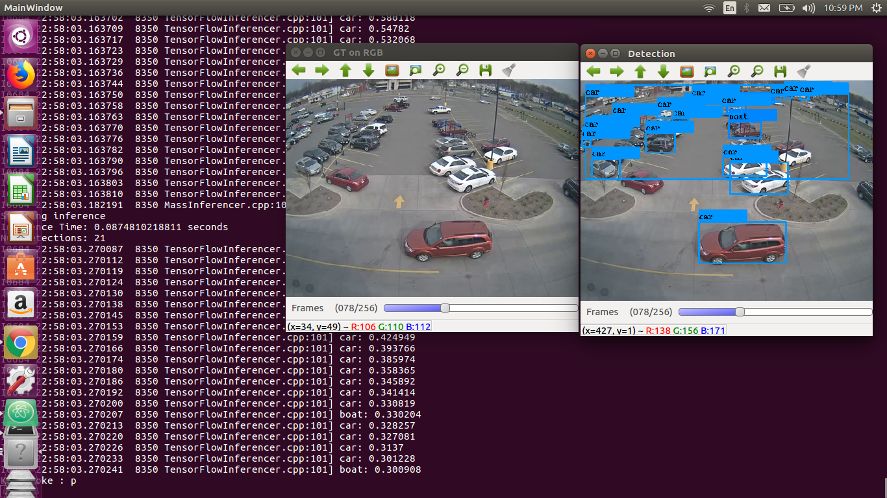
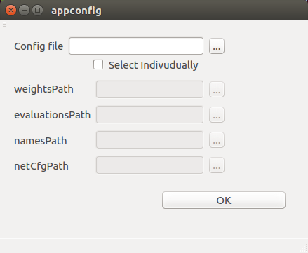

## Playback
This feature lets the user pause the video at any time and also go back and forward frame by frame. 

**How to pause the video:** press space bar, 'p' or 'k'.



## Better user experience
If a user does not add a config file when executing Detection Suite, a pop up window shows and asks the user to give the 
needed information.

A pop up window is also shown when the user forgets to give certain config paths, so this information can be included.



## Adjustable bounding boxes
With this functionality, a user can adjust the already given bounding boxes or even create new ones. The bounding boxes can 
easily be adjusted clicking and dragging.



## Change class names and add detections
A class provided for an object can be changed clicking in the bounding box containing the object. The new class can be taken from 
the already provided set and given a class probability.

Apart from this feature, new detections can be added. The workflow starts creating a bounding box with the mouse and then give this
object a class name and probability.



## ROS Node