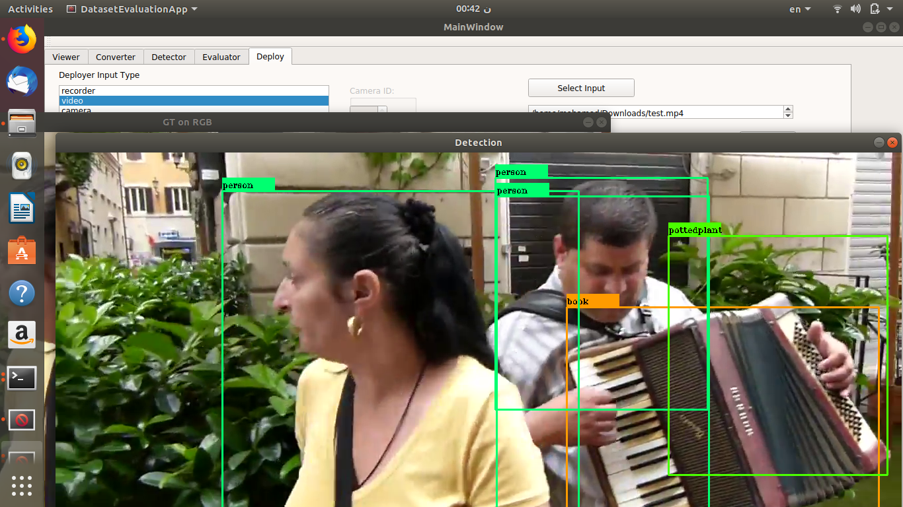
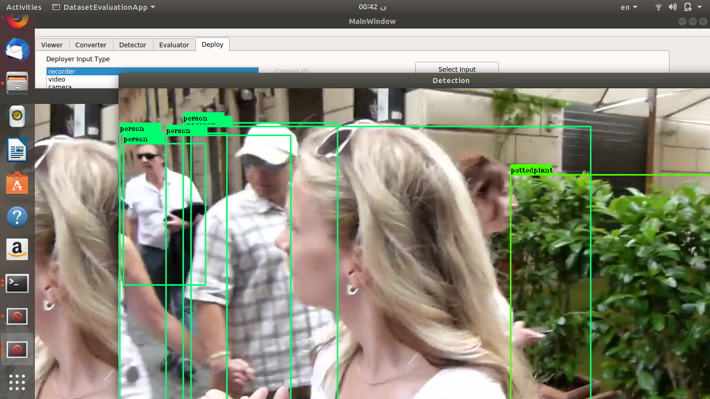

# What is DetectionSuite?

DetectionSuite is an application that provides a toolbox of utilities oriented to simplify the development and testing of solutions based on object detection.
The application comes with a GUI but it can also be used through command line.




# Toolbox

The application is designed to experiment with datasets and neural networks using various frameworks. Currently it comes with the following utilities:

+ [Auto Evaluator](functionality/automatic_evaluation/)
+ [Converter](functionality/converter/)
+ [Deployer](functionality/deployer/)
+ [Detector](functionality/detector/)
+ [Evaluator](functionality/evaluator/)
+ [Viewer](functionality/viewer/)
+ [Labelling](functionality/gsoc_19/)

Every tool in DetectionSuite requires a config file to run, where the main parameters needed are provided. Currently, YAML config file format is supported. See below on how to create a custom config file.
Each tool may have different requirements for keys in config file, and they can be known by passing the ```--help``` flag when using DetectionSuite from
the command line.

### Creating a custom ```appConfig.yml```

It is recommended to create and assign a dedicated directory for storing all datasets, weights and config files, for easier access and a cleaner ```appConfig.yml``` file.

For instance, we will be using ```/opt/datasets/``` for demonstration purposes.

Create the following directories in ```/opt/datasets/```: ```cfg```, ```names```, ```weights``` and ```eval```.

Again, these names are just examples and can be changed, but must also be changed in ```appConfig.yml```.

* ```cfg```: This directory will store config files for various networks. For example, [*yolo-voc.cfg*](https://github.com/pjreddie/darknet/blob/master/cfg/yolov3-voc.cfg).
* ```names```: This directory will contain class names for various datasets. For example, [*voc.names*](https://github.com/pjreddie/darknet/blob/master/data/voc.names).
* ```weights```: This directory will contain weights for various networks, such as [*yolo-voc.weights*](https://pjreddie.com/media/files/yolo-voc.weights) for YOLO or a frozen inference graph for Tensorflow trained networks.
* ```eval```: Evaluations path.

Once completed, you can create your own custom appConfig.yml like the one mentioned. For example:

```

datasetPath: /opt/datasets/

evaluationsPath: /opt/datasets/eval

weightsPath: /opt/datasets/weights

netCfgPath: /opt/datasets/cfg

namesPath: /opt/datasets/names

inferencesPath: /opt/datasets

```

Place your weights in weights directory, config files in cfg directory, classname files in names. And you are ready to go ⚡️ .

# Examples of input and output

  |   
  |  
